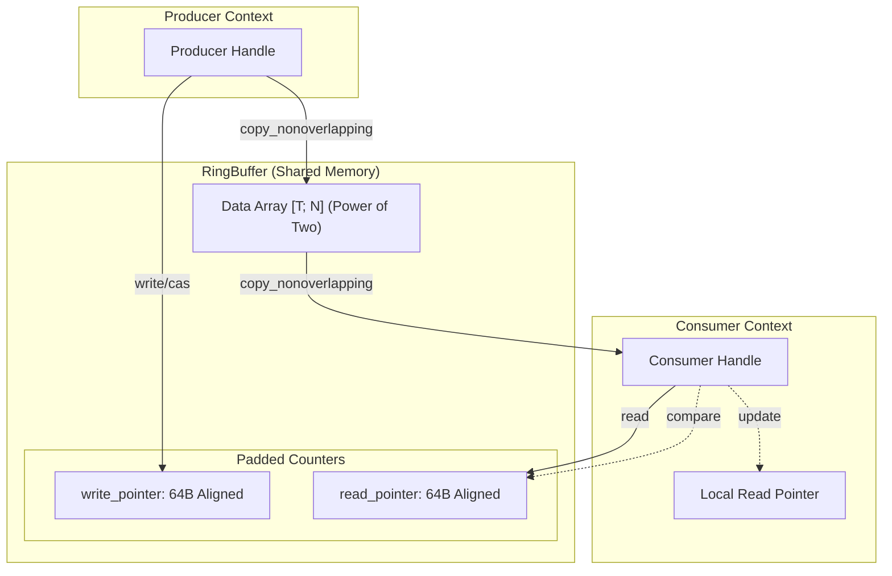
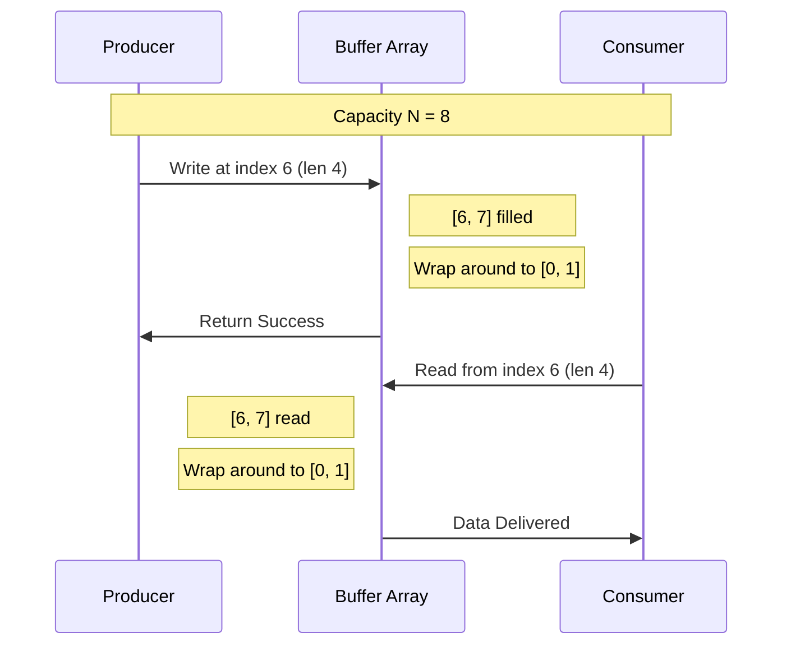

# Ring Buffer Architecture

A high-performance, lock-free, overwrite-capable ring buffer implementation in Rust. This library is designed for low-latency applications (e.g., HFT, audio processing) where thread synchronization overhead must be minimized.

## Visual Overview

### Memory Layout & Coordination


### Data Wrap-around logic


## Features

- **Lock-Free Design**: Uses atomic operations with `Acquire`/`Release` memory ordering for thread safety without mutexes or spinlocks.
- **Cache-Line Alignment**: Internal counters are padded to 64 bytes to prevent "false sharing," ensuring that producers and consumers don't contend for the same cache line.
- **Overwrite Semantics**: The producer can overwrite unread data if the buffer is full. This is ideal for telemetry or "latest-value" semantics where dropping old data is preferable to blocking.
- **Multiple Topologies**: Supports SPSC (Single Producer, Single Consumer), SPMC, MPSC, and MPMC configurations.
- **Efficient Indexing**: Uses bitwise masking for wrap-around logic, made possible by requiring power-of-two capacities.
- **Minimal Overhead**: Zero-copy data transfers using `copy_nonoverlapping`.

## Core Components

### `RingBuffer<T, N>`
The internal storage mechanism. It holds an `UnsafeCell` for the data array and two padded atomic pointers: `write_pointer` and `read_pointer`.

### `PaddedAtomicUsize`
A wrapper around `AtomicUsize` that ensures the value is isolated on its own cache line.

```rust
#[repr(align(64))]
pub(crate) struct PaddedAtomicUsize {
    value: AtomicUsize,
    _padding: [u8; 56], // 64 - 8 bytes
}
```

## Constraints & Requirements

### Power-of-Two Capacity
The capacity `N` **must** be a power of two. This allows the implementation to use `index & (N - 1)` instead of the much slower modulo operator `%`.

### Data Type Requirements
Elements must implement `Copy` and `Default`.
- `Copy`: Required for efficient `memcpy`-style transfers.
- `Default`: Required to initialize the underlying array.

### Memory Safety
The library uses `UnsafeCell` and raw pointer manipulation for performance. Safety is maintained by ensuring that:
1. Producers and consumers never hold mutable references to the same memory slot simultaneously (via atomic coordination).
2. The `write_pointer` always leads the `read_pointer` in logical sequence.

## Edge Cases and Behavior

### Buffer Full (Overwrite)
When the producer attempts to write more data than available space:
- In this implementation, the `write` operation **always succeeds** (assuming the write length <= capacity) by reserving space regardless of reader position.
- If the producer wraps around and catches up to the consumer, the consumer's local pointer is "jolted" forward in its next `read` call to ensure it always reads valid, non-torn data.

### Wrap-around Logic
Indices are incremented monotonically. The physical index in the array is derived by:
`index & (capacity - 1)`

### Reader Lag
If a reader is too slow, the producer will eventually overwrite the data the reader was intending to consume. The reader detects this by comparing its local pointer against the global `write_pointer`. If the gap exceeds `capacity`, the reader resets its tracker to the latest available data minus one.

## Usage Patterns

### SPSC (Single Producer Single Consumer)
The most efficient mode. Optimized for point-to-point communication between two threads.

```rust
let queue: SpscQueue<u64, 1024> = SpscQueue::new();
let (mut producer, mut consumer) = queue.split();

producer.write(&[1, 2, 3]);
let mut buf = [0u64; 3];
consumer.read(&mut buf);
```

### Thread Safety Invariants
- **SPSC**: `SingleProducer` and `SingleConsumer` are `!Clone`. Only one of each can exist.
- **MPMC**: `MultipleProducer` and `MultipleConsumer` are `Clone` and use `compare_exchange` to coordinate slot reservation.

## Performance Considerations

- **False Sharing**: Avoid placing unrelated atomics near the RingBuffer handles, although the internal padding already protects the sensitive counters.
- **Batching**: Writing/reading slices is significantly faster than single-element operations due to reduced atomic contention and better branch prediction.
