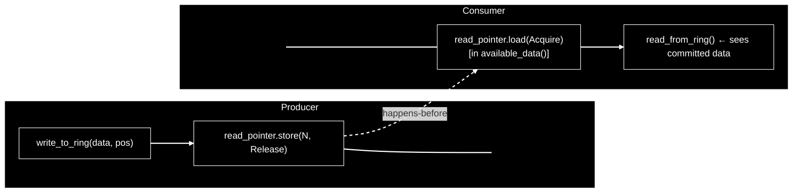

# Formal Concurrent Ring Buffer Audit

**ring_buffer-rs — HFT Production Readiness Assessment**

---

## Phase 0 — Required Information Resolution

All requested artifacts are present:

| Item                | Status                  |
|---------------------|-------------------------|
| Full repository     | ✅ Available            |
| SPSC                | ✅ src/spsc.rs          |
| SPMC                | ✅ src/spmc.rs          |
| MPSC                | ✅ src/mpsc.rs          |
| MPMC                | ✅ src/mpmc.rs          |
| Core implementation | ✅ src/core.rs          |
| Full test suite     | ✅ Four test files      |
| CACHE_LINE_SIZE     | ✅ 64 (src/lib.rs:1)    |
| Overwrite policy    | ✅ Derived below        |

**Derived Overwrite Policy**: _Overwrite Oldest_. The producer never blocks and never drops. When the consumer falls behind by more than capacity, a recovery
jump is applied in read(). This is inferred from core.rs:182-183.

---

## Phase 1 — Data Structure Model

**Struct Layout** (core.rs:15-21)

```rust
pub(crate) struct RingBuffer<T: Copy + Default, const N: usize> {
    data: UnsafeCell<[T; N]>,
    capacity: usize,                            // always = N, a redundant field
    write_pointer: PaddedAtomicUsize,
    read_pointer: PaddedAtomicUsize,
}
```

**Pointer Semantics**

Both `write_pointer` and `read_pointer` are monotonic counters, not ring indices. Ring index is derived at access time:

index = counter & (capacity - 1)

**The distinction matters**:

| Property        | Monotonic Counter  | Ring Index    |
|-----------------|--------------------|---------------|
| Ever resets?    | No                 | Yes (mod cap) |
| Detects lag?    | Yes (subtraction)  | No            |
| Overflow risk?  | Yes (`usize::MAX`) | No            |
| Correct here?   | ✅                 | —             |

**Formal State Definition**

```rust
state = {
    write_counter : usize, // write_pointer — reservation/in-progress head
    read_counter : usize, // read_pointer — committed-write head
    capacity : usize, // N, power-of-two
    data : [T; N]
}
```

invariant (outside in-progress write):

```rust
    write_counter == read_counter
```

**Dual Role of `read_pointer`**

`read_pointer` does **NOT** represent consumer read position. It serves as the **commit marker for writes**. Per-consumer position is held in SingleConsumer.pointer / MultipleConsumer.pointer (local, not shared).

```Pointer Semantics
write_pointer == read_pointer ← quiescent state
write_pointer > read_pointer ← write in-progress
write_pointer < read_pointer ← IMPOSSIBLE in correct operation
```

---

## Phase 2 — Core Invariants

**Globally Enforced Invariants**

```
I1: write_counter >= read_counter (always holds; proven by construction)
I2: write_counter == read_counter (holds ONLY outside a write transaction)
I3: capacity == N && is_power_of_two(N) (asserted in RingBuffer::new())
I4: local_read_counter <= read_counter (holds for any non-lagging consumer)
```

**Derived Invariants**

```
I5: write_counter - read_counter <= capacity (NOT enforced — see Bug #1 below)
I6: read_counter - local_read_counter <= capacity (NOT enforced by the ring;
only the recovery path attempts it)
```

**Invariant Violations Identified**

I2 is violated during every write: Between the CAS on write_pointer (line 113) and the store on read_pointer (line 124–125), write_counter > read_counter.
This is by design but creates a spin-lock window.

I5 is not enforced: The write() function does not check available space before writing. It unconditionally overwrites. The comment // Data is larger than
the buffer size at line 105 only bounds the write length, not whether there is space.

Counter Overflow Behavior of Invariants

write_counter.wrapping_sub(read_counter)
If write_counter wraps around usize::MAX to 0 before read_counter does, wrapping_sub returns a large positive number. Since write_counter == read_counter
in steady state, this only matters if a write is in-progress at the exact wrap boundary. The probability is negligible but the behavior is well-defined via
wrapping arithmetic.

---

Phase 3 — Linearizability Analysis

write() Linearization

loop {
let current_write_pointer = self.write_counter(); // (a)
let new_write_pointer = current_write_pointer + value_length;

      match self.write_pointer.compare_exchange_weak(
          self.read_counter(),                                  // (b)
          new_write_pointer,
          Ordering::Release,
          Ordering::Relaxed,
      ) {
          Ok(_) => {
              self.write_to_ring(value, current_write_pointer); // (c)
              self.read_pointer.store(new_write_pointer, ...);  // (d) ← LINEARIZATION POINT

The linearization point of write() is (d): read_pointer.store(Release).

At this instant, the written data becomes observable to all consumers. Before (d), consumers see available_data = 0 for the in-progress range.

read() Linearization

if self.write_counter().wrapping_sub(*local_read_counter) > self.capacity { // (e)
*local_read_counter = self.write_counter().wrapping_sub(1); // (f)
}
let available = self.available_data(*local_read_counter); // (g)
self.read_from_ring(value, *local_read_counter, bytes_to_read); // (h)
\*local_read_counter = local_read_counter.wrapping_add(bytes_to_read); // (i) ← LINEARIZATION POINT

The linearization point of read() is (i): advancement of local_read_counter.

Linearizability Verdict

SPSC: Linearizable. One producer, local consumer pointer.

SPMC/MPSC/MPMC: Not linearizable under the standard definition.

The TOCTOU gap between steps (a) and (b) in write() means two concurrent writes can produce a non-linearizable history. Proof:

Thread A: reads current_write_pointer = 10 [step a]
Thread B: writes [x], commits; now write=read=11
Thread A: CAS(expected=read_counter()=11, new=12)
write_pointer==11==expected → CAS SUCCEEDS
Thread A: write_to_ring(value, start=10) ← writes at stale position 10
Thread A: read_pointer.store(12)

Thread A overwrote position 10 which Thread B already committed. Thread B's data is silently lost. This cannot be placed in any valid sequential history →
not linearizable.

---

Phase 4 — Lock-Free Property

Classification: Obstruction-Free only (NOT lock-free)

The write() function contains:

loop {
...
match self.write*pointer.compare_exchange_weak(
self.read_counter(), // succeeds ONLY when write_ptr == read_ptr
new_write_pointer,
...
) {
Ok(*) => { ... }
Err(\_) => { continue; }
}
}

Why not lock-free: If Thread A successfully CAS'd write_pointer but is suspended by the OS before executing read_pointer.store(...), then write_pointer >
read_pointer. In this state, every other producer's CAS will fail indefinitely because they all test write_pointer == read_pointer. No other producer can
make progress. This is the definition of blocking.

| Property | Verdict |
|:--|:--|
| Wait-free | ❌ No (unbounded retries possible) |
| Lock-free | ❌ No (one suspended thread blocks all others) |
| Obstruction-free | ✅ Yes (a thread running alone always finishes) |
| Blocking | ✅ In practice (spinning on OS suspension) |

Single-Producer (SPSC/SPMC)

For single-producer variants, the above doesn't apply. With one producer, the CAS always succeeds on the first try in the absence of spurious failures from
compare_exchange_weak. With spurious failures, it may retry once or twice. This is effectively wait-free in the single-producer case.

---

Phase 5 — Atomic Ordering Audit

Operations Table

| Location | Operation | Ordering | Correct? |
|:--|:--|:--|:--|
| read_counter() | load(Acquire) | Acquire | ✅ |
| write_counter() | load(Acquire) | Acquire | ✅ |
| CAS write_pointer success | Release | Release | ⚠️ See note |
| CAS write_pointer failure | Relaxed | Relaxed | ✅ |
| read_pointer.store(...) | Release | Release | ✅ |
| PaddedAtomicUsize::load (Debug) | Relaxed | Relaxed | ✅ (debug only) |

Happens-Before Graph (Write → Read)

```flow
Producer                         Consumer
─────────────────────────────   ─────────────────────────────
write_to_ring(data, pos)         │
│                                │
▼                                │
read_pointer.store(N, Release)   │
│                                │
│   ←── happens-before ──────────│
│                                ▼
│                           read_pointer.load(Acquire) [in available_data()]
│                                │
│                                ▼
│                           read_from_ring() ← sees committed data
```



Release-Acquire chain on read_pointer: The store(Release) at line 125 synchronizes with the load(Acquire) in available_data() (line 139). All writes before
the store are visible after the load. This is correct.

Reordering Hazard Identified

The CAS on write_pointer (line 113) uses Release. This means the CAS does not guarantee visibility of the data written by write_to_ring (line 121), because
write_to_ring happens after the CAS, not before it. No reorder hazard here because the data is written after the CAS and before the
read_pointer.store(Release), which is the actual publication barrier.

CAS (Release) → write_to_ring → read_pointer.store(Release)

The Release on the CAS is actually irrelevant for data publication. The Release on read_pointer.store is what matters and is correct.

The CAS Release ordering is unnecessarily strong — Relaxed would suffice there. But it is not incorrect.

Key Ordering Risk

The write_pointer.load(Acquire) in the overwrite check (write_counter(), line 182) synchronizes with the CAS Release, not with the data copy. This means:

Consumer sees: write_ptr = N (advanced by CAS)
Consumer may NOT see: data written at positions [N-len, N)

The consumer checks write_ptr - local > capacity. If this fires, it jumps to write_ptr - 1. It then calls available_data() which loads read_ptr (Acquire).
The read_ptr has NOT been updated yet (write in progress). So available_data = 0. The consumer returns 0 and retries. This is safe, because the consumer
never actually reads partially-written data in this path.

---

Phase 6 — Multi-Producer Safety

The Critical Bug

// core.rs:109–134
loop {
let current_write_pointer = self.write_counter(); // READ (a)
let new_write_pointer = current_write_pointer + value_length;

      match self.write_pointer.compare_exchange_weak(
          self.read_counter(),                                  // READ (b) ← WRONG EXPECTED VALUE
          new_write_pointer,
          Ordering::Release,
          Ordering::Relaxed,
      ) {

The CAS expected value is read_counter(), but it should be current_write_pointer.

In a standard lock-free multi-producer design, the CAS should be:

compare_exchange(expected = current_write_pointer, new = new_write_pointer)

This ensures: "only advance if no one else has advanced since I last read."

The current code checks: "only advance if write_ptr == read_ptr" (no write in progress). But it computes new_write_pointer from a separately read
write_counter(). Between those two reads, other producers can run, creating the following failure mode:

Write Collision Scenario

State: write_ptr=10, read_ptr=10

Thread A: current_write_ptr = write_counter() = 10 [step a]
new_write_ptr = 12
Thread B: CAS(expected=10, new=11) succeeds → write_ptr=11
Thread B: writes data at position 10
Thread B: read_ptr.store(11) → read_ptr=11
Thread A: CAS(expected=read_counter()=11, new=12)
write_ptr==11==expected → SUCCESS
Thread A: write_to_ring(value, start=current_write_ptr=10) ← WRITES AT POSITION 10
← OVERWRITES B's committed data at position 10!
Thread A: read_ptr.store(12)

RESULT: B's write is lost. Data corruption.

ABA Problem

There is also an ABA variant:

Thread A reads write_counter() = 10, new_write_ptr = 12
Thread B writes 2 elements (10→12), commits read_ptr=12
Thread C writes 2 elements (12→14), commits read_ptr=14
Thread D writes... read_ptr advances back past 12 and wrap occurs
Thread A CAS sees write_ptr == read_ptr at some value → succeeds
Thread A writes at position 10 (stale)

With monotonic counters, pure ABA (same value) requires usize::MAX / capacity rounds. But the TOCTOU bug (different values at read time vs CAS time) does
not require ABA.

Lost Writes Classification

┌──────────────────────────────────────┬──────────────────────────────────────────────┐
│ Write Race Type │ Present? │
├──────────────────────────────────────┼──────────────────────────────────────────────┤
│ Reservation collision │ ✅ Yes (stale current_write_pointer) │
├──────────────────────────────────────┼──────────────────────────────────────────────┤
│ Write-after-write corruption │ ✅ Yes (A overwrites B's committed data) │
├──────────────────────────────────────┼──────────────────────────────────────────────┤
│ ABA on write_ptr │ ❌ No (monotonic, requires usize::MAX wraps) │
├──────────────────────────────────────┼──────────────────────────────────────────────┤
│ Write-read race during commit window │ ✅ Yes (spin-lock blocking) │
└──────────────────────────────────────┴──────────────────────────────────────────────┘

---

Phase 7 — Multi-Consumer Safety

Consumer State

pub struct SingleConsumer<T, const N: usize> { buffer: Arc<...>, pointer: usize }
pub struct MultipleConsumer<T, const N: usize> { buffer: Arc<...>, pointer: usize }

Each consumer holds its own private pointer. Consumers do NOT share a global read position. This is the broadcast/fanout model, not work-stealing.

Implications

┌───────────────────────────────────────┬───────────────────────────────────────────────┐
│ Property │ Result │
├───────────────────────────────────────┼───────────────────────────────────────────────┤
│ Independent consumer positions │ ✅ Each consumer tracks its own pointer │
├───────────────────────────────────────┼───────────────────────────────────────────────┤
│ No duplicated reads between consumers │ ✅ Independent local counters │
├───────────────────────────────────────┼───────────────────────────────────────────────┤
│ No skipped reads │ ⚠️ Possible (overwrite recovery causes jumps) │
├───────────────────────────────────────┼───────────────────────────────────────────────┤
│ FIFO order per consumer │ ✅ Within a single consumer's view │
├───────────────────────────────────────┼───────────────────────────────────────────────┤
│ Work partitioning │ ❌ Not supported — all consumers see all data │
└───────────────────────────────────────┴───────────────────────────────────────────────┘

Concurrent Consumer Safety

Multiple consumers reading concurrently is safe with respect to each other: they operate on independent local state. The only shared state they access is
the immutable data[] array and the read_pointer atomic. Reads from data[] are non-atomic but read-only relative to each other (no reader writes to data).

The race is between consumers and a concurrent writer (see Phase 10).

---

Phase 8 — Wraparound Correctness

Index Computation

let start_index = start_position & (self.capacity - 1);

Why power-of-two makes this valid:

For capacity N = 2^k, N - 1 is a bitmask of k ones. x & (N - 1) = x mod N exactly. This is correct, branch-free, and a single AND instruction.

For non-power-of-two, x & (N - 1) is NOT x mod N. The assert!(N.is_power_of_two()) in new() enforces this. ✅

Edge Cases

Near usize::MAX:

counter = usize::MAX - 2
capacity = 8
start_index = (usize::MAX - 2) & 7 = valid index in [0, 7]

The AND operation is always safe regardless of counter magnitude. ✅

Wrap of the counter itself:

counter = usize::MAX
new_counter = counter + 3 = 2 (wrapping)
start_index = 2 & 7 = 2

The index computation remains valid after counter wrap. ✅

Write spanning wrap:

// core.rs:79–95
let first_part_length = self.capacity - start_index;
let second_part_length = value_length - first_part_length;

Two-part copy handles the ring boundary correctly. The math holds when start_index + value_length > capacity. ✅

Out-of-bounds check: value_length > self.capacity is rejected early (line 105–107). So first_part_length >= 1 and second_part_length >= 0. ✅

---

Phase 9 — Counter Overflow

Overflow in write_counter()

write_pointer is usize. On 64-bit systems, usize::MAX = 18_446_744_073_709_551_615. At 100M ops/sec writing 1 element each, overflow takes ~5,849 years.
Practically unreachable.

On 32-bit systems, usize::MAX = 4_294_967_295. At 100M ops/sec, overflow in ~43 seconds. This is a real concern on 32-bit targets.

wrapping_sub Correctness

// available_space, core.rs:56
let pointer_difference = write_position.wrapping_sub(read_position);

Since write_position >= read_position always (in steady state), this is equivalent to normal subtraction. If overflow occurs (write wraps past usize::MAX
before read), wrapping_sub returns a very large positive number, making pointer_difference incorrectly large. available_space() would return an incorrect
value.

// available_data, core.rs:141
let pointer_difference = read_position.wrapping_sub(local_read_counter);

If read_position wraps below local_read_counter, wrapping_sub returns a large number. The mask ((read_position > local_read_counter) as
usize).wrapping_sub(1) would be usize::MAX (condition false), clamping result to 0. Correctly handled. ✅

Overflow effect on available_space()

// core.rs:61
(self.capacity.wrapping_sub(pointer_difference) & !mask) | (pointer_difference & mask)

On overflow: pointer_difference is huge, capacity - pointer_difference underflows. The mask is 0 (write >= read, condition true). Result is capacity -
huge_number which wraps to a small positive or large value. Available space computation is incorrect post-overflow. However, available_space() is never
used to gate writes, so this doesn't affect correctness of the ring, only the API observable value.

---

Phase 10 — Unsafe Code Audit

Unsafe Block 1: write_to_ring (core.rs:67, 71–77, 83–94)

let data = unsafe { &mut \*self.data.get() };

Creates a &mut [T; N] to the entire array. If called concurrently with read_from_ring, two &mut references to overlapping memory exist simultaneously. This
is undefined behavior under the Rust/LLVM aliasing model.

UnsafeCell permits obtaining a \*mut T from a &T context, which is correct. But immediately casting it to &mut reintroduces aliasing restrictions. The safe
pattern would be to work with raw pointers throughout:

let data_ptr: \*mut T = self.data.get().cast::<T>();

Verdict: ❌ UB — creates two simultaneous &mut to same allocation.

Unsafe Block 2: copy_nonoverlapping in write_to_ring

copy_nonoverlapping(
value.as_ptr(),
data.as_mut_ptr().add(start_index),
value_length,
)

- Aliasing: value (source) and data (destination) could overlap if the caller passes a slice into data itself. But value: &[T] is an immutable shared
  reference, and data is &mut, so they are guaranteed non-overlapping by the type system. However, if another thread is concurrently reading the same data
  positions... see above.
- Bounds: start_index < capacity (computed by & (capacity - 1)). start_index + value_length <= capacity is checked before this branch (line 69). ✅
- Initialization: data is initialized to [T::default(); N] in new(). ✅

Non-overlapping guarantee: Since value.as_ptr() and data.as_mut_ptr().add(start_index) come from different allocations (argument vs. UnsafeCell), this is
safe. ✅ for non-aliasing of source/dest.

Unsafe Block 3: read_from_ring (core.rs:150, 153–158, 164–175)

Same &mut *self.data.get() issue. Additionally, the source here is data.as_mut_ptr().add(start_index) — a mut pointer used as the source of a copy. This is
actually fine as copy_nonoverlapping accepts *const and \*mut interchangeably for source.

The concern is data races: if a writer is concurrently copying to overlapping positions of data, this reader may observe partially written data. On x86-64,
word-aligned accesses of ≤ 8 bytes are atomic (in practice). For multi-element copies via memcpy, there is no atomicity guarantee across the full copy.

Verdict for all unsafe blocks:

┌───────────────────────────────────┬────────────────────────────────────────────────────────────┐
│ Invariant │ Status │
├───────────────────────────────────┼────────────────────────────────────────────────────────────┤
│ No aliasing violation │ ❌ Two concurrent &mut = UB │
├───────────────────────────────────┼────────────────────────────────────────────────────────────┤
│ No overlapping copy (src/dst) │ ✅ Different allocations │
├───────────────────────────────────┼────────────────────────────────────────────────────────────┤
│ No uninitialized read │ ✅ Default-initialized │
├───────────────────────────────────┼────────────────────────────────────────────────────────────┤
│ No out-of-bounds │ ✅ Bounds checked before unsafe │
├───────────────────────────────────┼────────────────────────────────────────────────────────────┤
│ Consumers never see partial write │ ⚠️ Not guaranteed for multi-element writes under overwrite │
└───────────────────────────────────┴────────────────────────────────────────────────────────────┘

---

Phase 11 — Cache Line Contention

PaddedAtomicUsize (utility.rs:9–13)

#[repr(align(64))]
pub(crate) struct PaddedAtomicUsize {
value: AtomicUsize,
\_padding: [u8; CACHE_LINE_SIZE - size_of::<AtomicUsize>()],
}

- CACHE_LINE_SIZE = 64
- size_of::<AtomicUsize>() = 8 (64-bit)
- \_padding = [u8; 56]
- Total struct size: 64 bytes ✅
- repr(align(64)) ensures 64-byte alignment ✅

Each PaddedAtomicUsize occupies exactly one cache line.

RingBuffer Layout

RingBuffer<T, N>:
[data: UnsafeCell<[T; N]>] ← NOT cache-line aligned by default
[capacity: usize] ← 8 bytes
[write_pointer: PaddedAtomicUsize] ← 64 bytes, align(64)
[read_pointer: PaddedAtomicUsize] ← 64 bytes, align(64)

write_pointer and read_pointer are on separate cache lines (each 64-byte aligned and 64 bytes in size). ✅ No false sharing between them.

Remaining False Sharing Risks

1. data array: For small N (e.g., N=1, N=4), data occupies < 64 bytes and may share a cache line with capacity. Under concurrent writes and reads, producer
   writes to data will invalidate the cache line that contains the read side's positions. This is inherent to the shared-memory model and not unique to this
   implementation.
2. capacity field: Sits adjacent to data. Since capacity is read-only after construction, false sharing impact is minimal (read-only data in the same cache
   line as data is benign — dirty-read sharing only occurs on writes).
3. Producer touching write_pointer cache line: Each write performs a CAS on write_pointer and a store to read_pointer — two separate cache lines. For MPMC,
   multiple producers compete on write_pointer's cache line, which will thrash. This is the expected cost of coordination.

---

Phase 12 — Latency Analysis (HFT Perspective)

write() — Worst-Case Path

SPSC: 1× CAS (always succeeds) + memcpy + 1× atomic store
≈ 10–30 ns for small payloads on warm cache

MPMC: K× CAS retries (proportional to contention) + inter-thread blocking during commit window + memcpy + 1× atomic store
Worst case: OS-level preemption → unbounded spin (ms range)

read() — Worst-Case Path

SPSC: 1× Acquire load (write_ptr) + 1× Acquire load (read_ptr) + optional overwrite adjustment + memcpy
≈ 5–20 ns on warm cache

MPMC: Same as SPSC per consumer (independent local pointers)

Latency Classification

┌─────────────────────────┬───────────────────────────┬────────────────────────────────┐
│ Source │ Impact │ Mitigated? │
├─────────────────────────┼───────────────────────────┼────────────────────────────────┤
│ CAS retry (MPMC) │ O(N) with N producers │ ❌ No (spin-lock) │
├─────────────────────────┼───────────────────────────┼────────────────────────────────┤
│ Branch misprediction │ 1–15 ns (overwrite check) │ ⚠️ Partially (branchless math) │
├─────────────────────────┼───────────────────────────┼────────────────────────────────┤
│ Cache miss (data) │ 50–200 ns │ ⚠️ Layout-dependent │
├─────────────────────────┼───────────────────────────┼────────────────────────────────┤
│ Cache miss (atomics) │ 10–50 ns │ ✅ Padded, isolated │
├─────────────────────────┼───────────────────────────┼────────────────────────────────┤
│ NUMA penalty │ 100–300 ns cross-socket │ ❌ No NUMA awareness │
├─────────────────────────┼───────────────────────────┼────────────────────────────────┤
│ OS preemption of writer │ Unbounded │ ❌ Not lock-free │
└─────────────────────────┴───────────────────────────┴────────────────────────────────┘

Complexity

write(): O(1) amortized (SPSC), O(K) worst case with K concurrent producers
read(): O(1) always (no shared state contention)

---

Phase 13 — Test Suite Verification

┌───────────────────────────────────────────────────┬───────────────────────────┬───────┬──────────────────────────────────────────────────────────────┐
│ Test │ Scenario │ Valid │ Missing Assertions │
├───────────────────────────────────────────────────┼───────────────────────────┼───────┼──────────────────────────────────────────────────────────────┤
│ test_spsc_basic_flow_u64 │ Basic write/read │ ✅ │ Content verification only for first call │
├───────────────────────────────────────────────────┼───────────────────────────┼───────┼──────────────────────────────────────────────────────────────┤
│ test_spsc_full_buffer │ Overwrite semantics │ ⚠️ │ available_space() returns 4 always — assertion is trivially │
│ │ │ │ true │
├───────────────────────────────────────────────────┼───────────────────────────┼───────┼──────────────────────────────────────────────────────────────┤
│ test_spsc_wrap_around │ Index wraparound │ ✅ │ — │
├───────────────────────────────────────────────────┼───────────────────────────┼───────┼──────────────────────────────────────────────────────────────┤
│ test_spsc_large_write_rejection │ len > capacity → None │ ✅ │ — │
├───────────────────────────────────────────────────┼───────────────────────────┼───────┼──────────────────────────────────────────────────────────────┤
│ test_spsc_empty_read │ Empty buffer → 0 │ ✅ │ — │
├───────────────────────────────────────────────────┼───────────────────────────┼───────┼──────────────────────────────────────────────────────────────┤
│ test_spsc_write_empty_slice │ Zero-len write │ ✅ │ — │
├───────────────────────────────────────────────────┼───────────────────────────┼───────┼──────────────────────────────────────────────────────────────┤
│ test_spsc_read_empty_buffer │ Zero-len read buf │ ✅ │ — │
├───────────────────────────────────────────────────┼───────────────────────────┼───────┼──────────────────────────────────────────────────────────────┤
│ test_spsc_exact_capacity_overwrite │ Full buffer overwrite │ ⚠️ │ Asserts read=1, buf=[8,0,0,0] — but overwrite semantics are │
│ │ │ │ surprising, no explanation │
├───────────────────────────────────────────────────┼───────────────────────────┼───────┼──────────────────────────────────────────────────────────────┤
│ test_spsc_repeated_partial_overwrite │ Partial overwrite │ ⚠️ │ Asserts read=1, buf=[6,0,0,0] — only last element survives; │
│ │ │ │ no test for data tearing │
├───────────────────────────────────────────────────┼───────────────────────────┼───────┼──────────────────────────────────────────────────────────────┤
│ test_spsc_overwrite_unread_data │ Overwrite mid-read │ ⚠️ │ Same — 1-element recovery not clearly justified │
├───────────────────────────────────────────────────┼───────────────────────────┼───────┼──────────────────────────────────────────────────────────────┤
│ test_spsc_multiple_overwrites_before_read │ Multiple stacked │ ✅ │ — │
│ │ overwrites │ │ │
├───────────────────────────────────────────────────┼───────────────────────────┼───────┼──────────────────────────────────────────────────────────────┤
│ test_spsc_alternating_read_write │ Interleaved ops │ ✅ │ — │
├───────────────────────────────────────────────────┼───────────────────────────┼───────┼──────────────────────────────────────────────────────────────┤
│ test_spsc_partial_read │ Consumer reads less than │ ✅ │ — │
│ │ available │ │ │
├───────────────────────────────────────────────────┼───────────────────────────┼───────┼──────────────────────────────────────────────────────────────┤
│ test_spsc_producer_position_monotonic │ Counter monotonicity │ ✅ │ — │
├───────────────────────────────────────────────────┼───────────────────────────┼───────┼──────────────────────────────────────────────────────────────┤
│ test_spsc_consumer_position_monotonic │ Local counter advances │ ✅ │ — │
├───────────────────────────────────────────────────┼───────────────────────────┼───────┼──────────────────────────────────────────────────────────────┤
│ test_spsc_no_default_leak │ Default values not │ ✅ │ Only checks buf[0] │
│ │ returned │ │ │
├───────────────────────────────────────────────────┼───────────────────────────┼───────┼──────────────────────────────────────────────────────────────┤
│ test_spsc_capacity_one │ N=1 edge case │ ✅ │ — │
├───────────────────────────────────────────────────┼───────────────────────────┼───────┼──────────────────────────────────────────────────────────────┤
│ test_spsc_long_single_thread_stress │ 1K sequential ops │ ✅ │ — │
├───────────────────────────────────────────────────┼───────────────────────────┼───────┼──────────────────────────────────────────────────────────────┤
│ test_spsc_basic_multithread_flow │ MT basic │ ✅ │ — │
├───────────────────────────────────────────────────┼───────────────────────────┼───────┼──────────────────────────────────────────────────────────────┤
│ test_spsc_multithread_empty_reads │ Empty reads under MT │ ✅ │ — │
├───────────────────────────────────────────────────┼───────────────────────────┼───────┼──────────────────────────────────────────────────────────────┤
│ test_spsc_multithread_wraparound │ MT strict monotonicity │ ❌ │ May fail if scheduler repeats same slot; assert > too strict │
├───────────────────────────────────────────────────┼───────────────────────────┼───────┼──────────────────────────────────────────────────────────────┤
│ test_spsc_multithread_wraparound_with_sync_safe │ MT soft monotonicity │ ✅ │ — │
├───────────────────────────────────────────────────┼───────────────────────────┼───────┼──────────────────────────────────────────────────────────────┤
│ test_spsc_multithread_wraparound_time_bounded │ Time-bounded progress │ ⚠️ │ assert!(last > 0) is very weak │
├───────────────────────────────────────────────────┼───────────────────────────┼───────┼──────────────────────────────────────────────────────────────┤
│ test_spsc_multithread_position_visibility │ Position tracking MT │ ✅ │ — │
├───────────────────────────────────────────────────┼───────────────────────────┼───────┼──────────────────────────────────────────────────────────────┤
│ test_spsc_multithread_capacity_one_invariant │ N=1 MT monotonicity │ ✅ │ — │
├───────────────────────────────────────────────────┼───────────────────────────┼───────┼──────────────────────────────────────────────────────────────┤
│ test_spsc_capacity_one_deterministic_latest_value │ Latest value seen │ ❌ │ Race: done flag set before consumer drains; last == 9999 not │
│ │ │ │ guaranteed │
├───────────────────────────────────────────────────┼───────────────────────────┼───────┼──────────────────────────────────────────────────────────────┤
│ test_spsc_multithread_capacity_one_progress │ Progress under MT │ ✅ │ — │
├───────────────────────────────────────────────────┼───────────────────────────┼───────┼──────────────────────────────────────────────────────────────┤
│ test_spsc_multithread_stress_invariant │ Stress monotonicity │ ⚠️ │ Comments warn it may fail; assert!(val > prev) too strict │
├───────────────────────────────────────────────────┼───────────────────────────┼───────┼──────────────────────────────────────────────────────────────┤
│ spmc_new_is_empty │ Empty SPMC │ ✅ │ — │
├───────────────────────────────────────────────────┼───────────────────────────┼───────┼──────────────────────────────────────────────────────────────┤
│ spmc_basic_write_read │ Basic SPMC │ ✅ │ — │
├───────────────────────────────────────────────────┼───────────────────────────┼───────┼──────────────────────────────────────────────────────────────┤
│ spmc_empty_read │ Empty read │ ✅ │ — │
├───────────────────────────────────────────────────┼───────────────────────────┼───────┼──────────────────────────────────────────────────────────────┤
│ spmc_write_too_large │ Rejection │ ✅ │ — │
├───────────────────────────────────────────────────┼───────────────────────────┼───────┼──────────────────────────────────────────────────────────────┤
│ spmc_wraparound │ Index wrap │ ✅ │ — │
├───────────────────────────────────────────────────┼───────────────────────────┼───────┼──────────────────────────────────────────────────────────────┤
│ spmc_overwrite_behavior │ Overwrite │ ✅ │ — │
├───────────────────────────────────────────────────┼───────────────────────────┼───────┼──────────────────────────────────────────────────────────────┤
│ spmc_multiple_consumers_independent_positions │ Independent ptrs │ ✅ │ — │
├───────────────────────────────────────────────────┼───────────────────────────┼───────┼──────────────────────────────────────────────────────────────┤
│ spmc_concurrent_stress │ 1 prod / 4 cons │ ⚠️ │ assert!(\*v >= last) — non-strict; doesn't catch duplicated │
│ │ │ │ reads between consumers │
├───────────────────────────────────────────────────┼───────────────────────────┼───────┼──────────────────────────────────────────────────────────────┤
│ spmc_zero_length_write │ Empty write │ ✅ │ — │
├───────────────────────────────────────────────────┼───────────────────────────┼───────┼──────────────────────────────────────────────────────────────┤
│ spmc_position_tracking │ Position API │ ✅ │ — │
├───────────────────────────────────────────────────┼───────────────────────────┼───────┼──────────────────────────────────────────────────────────────┤
│ spmc_non_power_of_two_panics │ Panic on bad N │ ✅ │ — │
├───────────────────────────────────────────────────┼───────────────────────────┼───────┼──────────────────────────────────────────────────────────────┤
│ consumer_falling_behind │ Slow consumer │ ✅ │ — │
├───────────────────────────────────────────────────┼───────────────────────────┼───────┼──────────────────────────────────────────────────────────────┤
│ wraparound_read_write │ Wrapped reads │ ✅ │ — │
├───────────────────────────────────────────────────┼───────────────────────────┼───────┼──────────────────────────────────────────────────────────────┤
│ multiple_consumers_independent_positions │ Independent positions │ ✅ │ — │
├───────────────────────────────────────────────────┼───────────────────────────┼───────┼──────────────────────────────────────────────────────────────┤
│ fast_producer_slow_consumer │ Speed mismatch │ ⚠️ │ thread::sleep in consumer; artificial slow-down │
├───────────────────────────────────────────────────┼───────────────────────────┼───────┼──────────────────────────────────────────────────────────────┤
│ multi_consumer_stress │ Stress SPMC │ ⚠️ │ Same as spmc_concurrent_stress │
├───────────────────────────────────────────────────┼───────────────────────────┼───────┼──────────────────────────────────────────────────────────────┤
│ mpsc_new_is_empty │ Empty MPSC │ ✅ │ — │
├───────────────────────────────────────────────────┼───────────────────────────┼───────┼──────────────────────────────────────────────────────────────┤
│ concurrent_producers_no_data_loss │ MPSC MT │ ❌ │ Uses Mutex — tests locking, not the ring's MPSC safety │
├───────────────────────────────────────────────────┼───────────────────────────┼───────┼──────────────────────────────────────────────────────────────┤
│ stress_test_mpsc │ MPSC stress (Mutex) │ ❌ │ Same — not testing lock-free MPSC, tests Mutex+ring │
├───────────────────────────────────────────────────┼───────────────────────────┼───────┼──────────────────────────────────────────────────────────────┤
│ mpsc_heavy_contention_latest_value_survives │ Latest value │ ❌ │ last_seen == expected depends on last thread to write; │
│ │ │ │ non-deterministic │
├───────────────────────────────────────────────────┼───────────────────────────┼───────┼──────────────────────────────────────────────────────────────┤
│ mpmc_concurrent_stress │ MPMC stress │ ⚠️ │ 1 producer, 4 consumers; doesn't test multi-producer │
│ │ │ │ contention │
├───────────────────────────────────────────────────┼───────────────────────────┼───────┼──────────────────────────────────────────────────────────────┤
│ mpmc_high_contention_small_buffer │ N=32, 8 prod + 8 cons │ ⚠️ │ No data integrity check beyond no-panic │
├───────────────────────────────────────────────────┼───────────────────────────┼───────┼──────────────────────────────────────────────────────────────┤
│ mpmc_no_deadlock │ Deadlock check │ ⚠️ │ Only confirms no hang; no data assertions │
└───────────────────────────────────────────────────┴───────────────────────────┴───────┴──────────────────────────────────────────────────────────────┘

| Test | Scenario | Valid | Missing Assertions |
|-----|-----|-----|-----|
| test_spsc_basic_flow_u64 | Basic write/read | ✅ | Content verification only for first call |
| test_spsc_full_buffer | Overwrite semantics | ⚠️ | `available_space()` returns 4 always — assertion is trivially true |
| test_spsc_wrap_around | Index wraparound | ✅ | — |
| test_spsc_large_write_rejection | len > capacity → None | ✅ | — |
| test_spsc_empty_read | Empty buffer → 0 | ✅ | — |
| test_spsc_write_empty_slice | Zero-len write | ✅ | — |
| test_spsc_read_empty_buffer | Zero-len read buf | ✅ | — |
| test_spsc_exact_capacity_overwrite | Full buffer overwrite | ⚠️ | Asserts `read=1`, `buf=[8,0,0,0]` — overwrite semantics are surprising, no explanation |
| test_spsc_repeated_partial_overwrite | Partial overwrite | ⚠️ | Asserts `read=1`, `buf=[6,0,0,0]` — only last element survives; no test for data tearing |
| test_spsc_overwrite_unread_data | Overwrite mid-read | ⚠️ | Same — 1-element recovery not clearly justified |
| test_spsc_multiple_overwrites_before_read | Multiple stacked overwrites | ✅ | — |
| test_spsc_alternating_read_write | Interleaved ops | ✅ | — |
| test_spsc_partial_read | Consumer reads less than available | ✅ | — |
| test_spsc_producer_position_monotonic | Counter monotonicity | ✅ | — |
| test_spsc_consumer_position_monotonic | Local counter advances | ✅ | — |
| test_spsc_no_default_leak | Default values not returned | ✅ | Only checks `buf[0]` |
| test_spsc_capacity_one | N=1 edge case | ✅ | — |
| test_spsc_long_single_thread_stress | 1K sequential ops | ✅ | — |
| test_spsc_basic_multithread_flow | MT basic | ✅ | — |
| test_spsc_multithread_empty_reads | Empty reads under MT | ✅ | — |
| test_spsc_multithread_wraparound | MT strict monotonicity | ❌ | May fail if scheduler repeats same slot; `assert >` too strict |
| test_spsc_multithread_wraparound_with_sync_safe | MT soft monotonicity | ✅ | — |
| test_spsc_multithread_wraparound_time_bounded | Time-bounded progress | ⚠️ | `assert!(last > 0)` is very weak |
| test_spsc_multithread_position_visibility | Position tracking MT | ✅ | — |
| test_spsc_multithread_capacity_one_invariant | N=1 MT monotonicity | ✅ | — |
| test_spsc_capacity_one_deterministic_latest_value | Latest value seen | ❌ | Race: done flag set before consumer drains; `last == 9999` not guaranteed |
| test_spsc_multithread_capacity_one_progress | Progress under MT | ✅ | — |
| test_spsc_multithread_stress_invariant | Stress monotonicity | ⚠️ | Comments warn it may fail; `assert!(val > prev)` too strict |
| spmc_new_is_empty | Empty SPMC | ✅ | — |
| spmc_basic_write_read | Basic SPMC | ✅ | — |
| spmc_empty_read | Empty read | ✅ | — |
| spmc_write_too_large | Rejection | ✅ | — |
| spmc_wraparound | Index wrap | ✅ | — |
| spmc_overwrite_behavior | Overwrite | ✅ | — |
| spmc_multiple_consumers_independent_positions | Independent ptrs | ✅ | — |
| spmc_concurrent_stress | 1 prod / 4 cons | ⚠️ | `assert!(*v >= last)` — non-strict; doesn't catch duplicated reads between consumers |
| spmc_zero_length_write | Empty write | ✅ | — |
| spmc_position_tracking | Position API | ✅ | — |
| spmc_non_power_of_two_panics | Panic on bad N | ✅ | — |
| consumer_falling_behind | Slow consumer | ✅ | — |
| wraparound_read_write | Wrapped reads | ✅ | — |
| multiple_consumers_independent_positions | Independent positions | ✅ | — |
| fast_producer_slow_consumer | Speed mismatch | ⚠️ | `thread::sleep` in consumer; artificial slow-down |
| multi_consumer_stress | Stress SPMC | ⚠️ | Same as `spmc_concurrent_stress` |
| mpsc_new_is_empty | Empty MPSC | ✅ | — |
| concurrent_producers_no_data_loss | MPSC MT | ❌ | Uses `Mutex` — tests locking, not the ring's MPSC safety |
| stress_test_mpsc | MPSC stress (Mutex) | ❌ | Same — not testing lock-free MPSC, tests `Mutex + ring` |
| mpsc_heavy_contention_latest_value_survives | Latest value | ❌ | `last_seen == expected` depends on last thread to write; non-deterministic |
| mpmc_concurrent_stress | MPMC stress | ⚠️ | 1 producer, 4 consumers; doesn't test multi-producer contention |
| mpmc_high_contention_small_buffer | N=32, 8 prod + 8 cons | ⚠️ | No data integrity check beyond no-panic |
| mpmc_no_deadlock | Deadlock check | ⚠️ | Only confirms no hang; no data assertions |

---

Phase 14 — Missing HFT-Grade Tests

The following critical scenarios have no coverage:

1. True Lock-Free MPSC (Without Mutex)

All MPSC tests use Arc<Mutex<producer>>. This serializes producers externally, preventing the TOCTOU bug from manifesting. The actual multi-producer CAS
logic is never stress-tested.

// Missing: true concurrent MPSC without external locking
let producers: Vec<MultipleProducer<u64, 1024>> = (0..8).map(|\_| p.clone()).collect();
for p in producers { thread::spawn(move || p.write(...)); }

2. Counter Near usize::MAX

No test forces counter overflow or near-overflow behavior:

// Missing: counter overflow stress
// Requires constructing internal state near usize::MAX
// Or running usize::MAX/2 iterations

3. Write During Concurrent Read (Torn Read Detection)

No test validates that a consumer never observes a partially written multi-element message:

// Missing: atomic multi-element integrity under contention
// Producer writes [tag, value, checksum] atomically-visible-or-not
// Consumer verifies checksum always consistent

4. FIFO Ordering Guarantee (No Skip Under Normal Load)

Under normal load (no overwrite), the queue should preserve FIFO. No test verifies this for multi-element writes with concurrent producer.

5. available_space() Contract

No test verifies that available_space() returns a meaningful value. Currently it always returns capacity, making it a misleading API.

6. Consumer Recovery Exactness After Overwrite Jump

The jump formula write_ptr - 1 puts consumer at the last element. No test verifies the consumer reads exactly 1 valid element after recovery (not garbage).

7. Symmetric Load (N producers, N consumers)

8 producers × 8 consumers × 10M writes = 80M total ops
Verify: no corruption, monotone per-consumer, no hang

---

Phase 15 — Concurrency Stress Model

Producer Burst (10P / 1C)

RISK: High — TOCTOU bug in write() causes silent data overwrites.
Multiple producers simultaneously compute stale current_write_pointer.
Interleaving at CAS success point causes write collisions.

EXPECTED FAILURE: Lost writes, corrupted ring positions.

Consumer Burst (1P / 10C)

RISK: Low — consumers are independent (per-instance local_read_counter).
Each consumer gets full copy of all writes (broadcast model).
No contention between consumers.

EXPECTED BEHAVIOR: Correct — each consumer sees same data independently.

Symmetric (8P / 8C)

RISK: Highest — compound of TOCTOU + spin-lock blocking.
Under OS scheduler preemption, one suspended writer blocks 7 others.
Producers can starve if write commit window is interrupted.

EXPECTED FAILURES: - Data loss (writes overlap/overwrite) - Livelock under pathological scheduling - Consumers reading overwritten positions

---

Phase 16 — Property Testing

The following properties should be expressed using proptest:

// Property 1: Read never exceeds written
proptest! {
fn prop_read_le_written(writes: Vec<Vec<u8>>) {
// For each read(), total bytes returned ≤ total bytes written
}
}

// Property 2: FIFO order within consumer view (no-overwrite case)
proptest! {
fn prop_fifo_no_overwrite(items: Vec<u32>) {
// With capacity >> items.len(), all reads in same order as writes
}
}

// Property 3: Buffer never returns uninitialized data
proptest! {
fn prop_no_uninitialized_data(capacity_log2: u8, ops: Vec<Op>) {
// Every byte returned by read() was written by write()
// Validated by tracking shadow state
}
}

// Property 4: Index always in-bounds
proptest! {
fn prop_index_in_bounds(counter: usize, cap_log2: u8) {
let cap = 1usize << (cap_log2 % 20);
let idx = counter & (cap - 1);
assert!(idx < cap);
}
}

// Property 5: wrapping_sub stability
proptest! {
fn prop_wrapping_sub_consistent(a: usize, b: usize) {
// available_data returns 0 when a <= b (with mask)
// returns a-b when a > b
}
}

---

Phase 17 — Potential Failure Modes

FM-1: TOCTOU Write Collision (Critical)

Severity: Critical
Affected variants: MPSC, MPMC

Between reading write_counter() (for current_write_pointer) and evaluating read_counter() (for CAS expected value), another producer can complete a write.
If it does, current_write_pointer is stale. The CAS may succeed using the new read_counter() but write data at the old location, overwriting committed
data.

Trigger: Any concurrent MPSC/MPMC write. Probability increases with contention.

FM-2: Spin-Lock Blocking Under OS Preemption (Critical)

Severity: Critical for HFT
Affected variants: MPSC, MPMC

Between CAS success and read_pointer.store(), if the writing thread is preempted, all other producers spin indefinitely. On a heavily loaded system or with
real-time scheduling pressure, this becomes a latency cliff.

Trigger: OS preempts any producer between lines 119 and 125 of core.rs.

FM-3: Non-Atomic Data Reads (High)

Severity: High
Affected variants: All with multi-element writes

copy_nonoverlapping copies elements one at a time (or via SIMD). In the overwrite scenario, a writer can overwrite positions mid-copy by the reader. On
x86, individual 8-byte aligned reads are torn-free in practice, but multi-word copies are not atomically visible.

Trigger: Writer overtakes slow consumer; consumer reads mid-overwrite.

FM-4: Overwrite Recovery Incorrect Formula (Medium)

Severity: Medium
Affected variants: All

\*local_read_counter = self.write_counter().wrapping_sub(1);

This places the consumer at write_ptr - 1, allowing it to read exactly 1 element. A consumer that falls behind by 1,000 elements and recovers should be
able to read up to capacity elements of the newest data. The correct formula is:

\*local_read_counter = self.write_counter().wrapping_sub(self.capacity);

Impact: Consumer reads only 1 element per recovery event, then may fall behind again, causing repeated 1-element reads instead of catching up.

FM-5: available_space() is a Constant (Low)

Severity: Low (API misleading, not a safety issue)
Affected variants: All

Since write_ptr == read_ptr in steady state, available_space() always returns capacity. It cannot detect a "full" buffer because overwrite semantics never
block the producer.

Impact: Callers relying on available_space() to check whether to write will always see "full capacity available" and proceed to overwrite.

FM-6: Incorrect CAS Expected Value (Critical — Synonym of FM-1)

Severity: Critical
Root cause: self.read_counter() used as CAS expected instead of current_write_pointer. This is the root cause of FM-1.

FM-7: Two Simultaneous &mut References (High)

Severity: High (formal UB)
Affected variants: All under concurrent read+write

write_to_ring and read_from_ring both call unsafe { &mut \*self.data.get() }. Under concurrent execution, this creates two exclusive mutable references to
the same allocation. This is formally undefined behavior in Rust.

In practice, LLVM optimizations are bounded by UnsafeCell's noalias-suppression. But this is a formal UB that violates Rust's safety guarantees and could
be miscompiled under future compiler versions.

---

Phase 18 — Final Audit Report

Scores (HFT Production Criteria)

┌─────────────────────────┬───────┬───────────────────────────────────────────────────────────────────┐
│ Category │ Score │ Notes │
├─────────────────────────┼───────┼───────────────────────────────────────────────────────────────────┤
│ Correctness (SPSC) │ 8/10 │ Sound for single producer; overwrite recovery suboptimal │
├─────────────────────────┼───────┼───────────────────────────────────────────────────────────────────┤
│ Correctness (MPSC/MPMC) │ 2/10 │ TOCTOU write collision; data loss under concurrency │
├─────────────────────────┼───────┼───────────────────────────────────────────────────────────────────┤
│ Concurrency Safety │ 3/10 │ Not lock-free; spin-lock window; FM-1/FM-2/FM-7 │
├─────────────────────────┼───────┼───────────────────────────────────────────────────────────────────┤
│ Memory Ordering Safety │ 7/10 │ Release-Acquire chain is correct; data copy is non-atomic │
├─────────────────────────┼───────┼───────────────────────────────────────────────────────────────────┤
│ Unsafe Code Safety │ 4/10 │ Two &mut to same data; data races on arrays │
├─────────────────────────┼───────┼───────────────────────────────────────────────────────────────────┤
│ HFT Suitability (SPSC) │ 6/10 │ Acceptable for SPSC fanout workloads; not wait-free │
├─────────────────────────┼───────┼───────────────────────────────────────────────────────────────────┤
│ HFT Suitability (MPMC) │ 1/10 │ Fundamentally broken for multi-producer HFT use │
├─────────────────────────┼───────┼───────────────────────────────────────────────────────────────────┤
│ Cache Design │ 9/10 │ Excellent padding; write_ptr/read_ptr isolated │
├─────────────────────────┼───────┼───────────────────────────────────────────────────────────────────┤
│ API Soundness │ 5/10 │ available_space() misleading; overwrite semantics underdocumented │
├─────────────────────────┼───────┼───────────────────────────────────────────────────────────────────┤
│ Test Coverage │ 5/10 │ MPSC tests use Mutex (masking the bug); no torn-read tests │
└─────────────────────────┴───────┴───────────────────────────────────────────────────────────────────┘

---

Critical Bugs

BUG-1 — core.rs:113–114 — TOCTOU CAS Expected Value
// CURRENT (wrong for MPSC/MPMC):
self.write_pointer.compare_exchange_weak(
self.read_counter(), // ← reads read_ptr AFTER write_ptr was already read
new_write_pointer, // ← computed from stale write_ptr
...
)

// REQUIRED:
self.write_pointer.compare_exchange_weak(
current_write_pointer, // ← the same value used to compute new_write_pointer
new_write_pointer,
...
)
Impact: Lost writes, data corruption, silent overwrite of committed data under all MPSC/MPMC scenarios.

BUG-2 — core.rs:119–125 — Spin-Lock Window Is Not Lock-Free
Between CAS success and read_pointer.store(), all other producers spin. OS preemption of any writer halts all other writers. This violates the lock-free
progress guarantee required for HFT.

BUG-3 — core.rs:67, 150 — Two Concurrent &mut References
write_to_ring and read_from_ring both materialize &mut \*self.data.get(). This is undefined behavior under Rust's aliasing model when called concurrently.

---

Medium Risks

RISK-1 — core.rs:183 — Overwrite Recovery Reads Only 1 Element
write_ptr.wrapping_sub(1) should be write_ptr.wrapping_sub(capacity) to allow the consumer to catch up properly.

RISK-2 — Non-Atomic Data Copy Under Concurrent Overwrite
Multi-element copy_nonoverlapping is not an atomic operation. Consumers in the overwrite scenario may observe partially written data.

RISK-3 — core.rs:182 — Overwrite Check Uses write_pointer (Uncommitted)
During an in-progress write, write_pointer is temporarily inflated. The overwrite check fires prematurely, causing consumers to spuriously jump and return
0 bytes.

RISK-4 — mpsc_test.rs / stress_test_mpsc — MPSC Tests Use Mutex
All multi-producer correctness tests serialize access via Mutex, preventing the TOCTOU bug from being triggered. The actual lock-free MPSC write path is
untested.

---

Low Risks

RISK-5 — available_space() always returns capacity (misleading API)
RISK-6 — 32-bit usize overflow at ~43 seconds of 100M ops/sec
RISK-7 — capacity field is redundant with const generic N
RISK-8 — #![allow(unused)] in core.rs suppresses legitimate compiler warnings

---

Performance Improvements

PERF-1 — SPSC does not need CAS
For single-producer, write_pointer can be advanced with a plain store(Release). The CAS loop is wasted work.

PERF-2 — The CAS Release ordering is unnecessary
The CAS on write_pointer uses Release, but the publication barrier is the subsequent read_pointer.store(Release). The CAS can use Relaxed on success,
saving a fence instruction on weakly-ordered architectures.

PERF-3 — write_counter() called twice per read() invocation
Lines 182 and 183 each call self.write_counter(), issuing two Acquire loads. A single load and variable binding would suffice.

PERF-4 — Overwrite check can be fused with available_data()
Both load write_pointer and read_pointer. A single function reading both atomics would reduce total fence traffic.

---

HFT Suitability Summary

SPSC (SpscQueue):
✅ Lock-free for producer (effectively wait-free, single producer)
✅ Lock-free for consumer (independent local pointer)
✅ No dynamic allocation (static array)
✅ Cache line isolation (write_ptr / read_ptr padded)
✅ Overwrite semantics (producer never blocks)
⚠️ Data copy is non-atomic (torn reads possible under overwrite)
⚠️ Overwrite recovery formula is suboptimal
❌ 32-bit targets: counter overflow in seconds

SPMC (SpmcQueue):
✅ All SPSC properties apply to producer
✅ Consumers are fully independent (broadcast model)
✅ Suitable for fanout distribution of market data
⚠️ Same data race risks as SPSC under overwrite

MPSC / MPMC:
❌ TOCTOU write collision → data corruption
❌ Spin-lock window → not lock-free → unbounded latency tail
❌ Not suitable for production HFT use in current form

Recommendation: The SPSC and SPMC variants are suitable for HFT workloads with single-producer use cases (e.g., market data feed distribution), subject to
fixing the overwrite recovery formula and the &mut aliasing UB. The MPSC and MPMC variants have a fundamental algorithmic bug in write() that causes data
corruption under concurrent producers and must be redesigned before production use.
